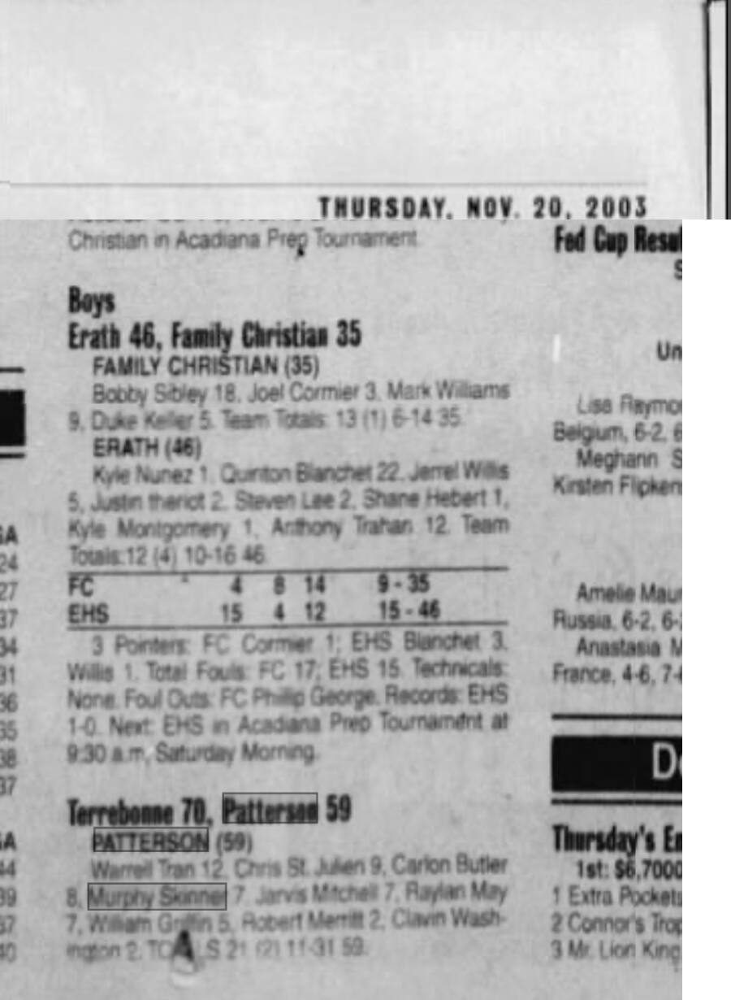

# Terrebonne 70, Patterson 59 — November 2003

## Recovered source

- Publication date visible in screenshot: Thursday, November 20, 2003
- Publication name: not visible
- Page number: not visible
- Result: Terrebonne 70, Patterson 59
- Murphy Skinner: 7 points for Patterson
- Archive platform: Newspapers.com

This is a second located source for the game. The basketball archive already cited *The Daily Review*, November 19, 2003, page 13, for the same result and scoring line.
