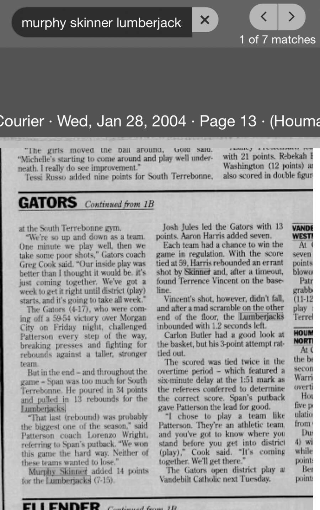

# Patterson 71, South Terrebonne 65 (OT) — January 2004

## Recovered source

- Publication: *The Courier* (Houma, Louisiana)
- Publication date: Wednesday, January 28, 2004
- Page: 13
- Result: Patterson 71, South Terrebonne 65 in overtime
- Murphy Skinner: 14 points
- Archive platform: Newspapers.com

The continuation reports that the game was tied 59–59 after regulation. The score was tied twice during overtime before Warrell Span's putback gave Patterson the lead for good. Skinner added 14 points for the Lumberjacks, who improved to 7–15.

This is a second located source for the game. *The Daily Review*, January 28, 2004, page 8, also reports Patterson's 71–65 overtime victory and Skinner's 14 points.
