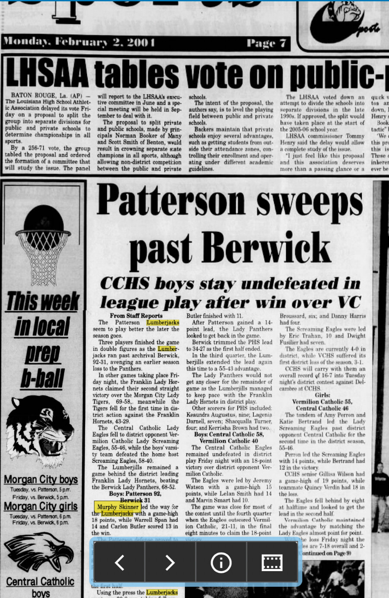

# Patterson 92, Berwick 31 — January 2004

*The Daily Review*, Monday, February 2, 2004, page 7.

- Approximate game date: January 30, 2004
- Result: Patterson 92, Berwick 31
- Murphy Skinner: game-high 18 points
- Warrell Span: 14 points
- Carlon Butler: 13 points
- Context: Patterson avenged an earlier loss to Berwick with a 61-point victory.

