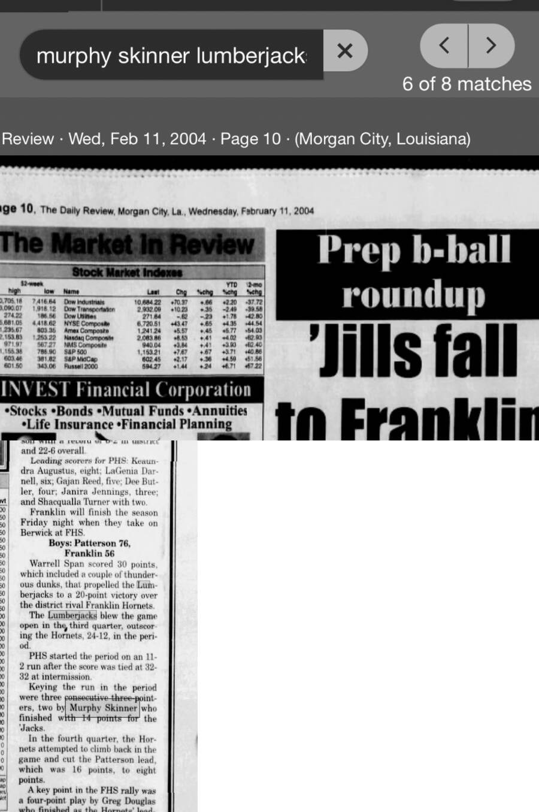

# Patterson 76, Franklin 56 — February 2004

## Recovered source

- Publication: *The Daily Review* (Morgan City, Louisiana)
- Publication date: Wednesday, February 11, 2004
- Page: 10
- Result: Patterson 76, Franklin 56
- Murphy Skinner: 14 points
- Archive platform: Newspapers.com

The article reports that Patterson broke open a 32–32 halftime tie by outscoring Franklin 24–12 in the third quarter. Patterson began the period with an 11–2 run, keyed by three consecutive three-pointers; Skinner made two of them and finished with 14 points.

This game and scoring total were already included in the archive. The recovered screenshots were added as direct source evidence and do not represent an additional game or additional points.
