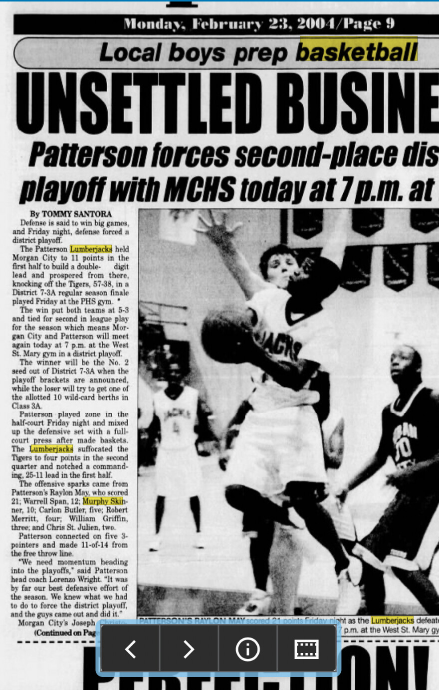

# Patterson 57, Morgan City 38 — February 2004

*The Daily Review*, Monday, February 23, 2004, page 9.

- Game date: February 20, 2004
- Result: Patterson 57, Morgan City 38
- Murphy Skinner: 10 points
- Raylon May: 21 points
- Warrell Span: 12 points
- Context: The regular-season finale left Patterson and Morgan City tied for second in District 7-3A, forcing a playoff for the district's No. 2 seed.

