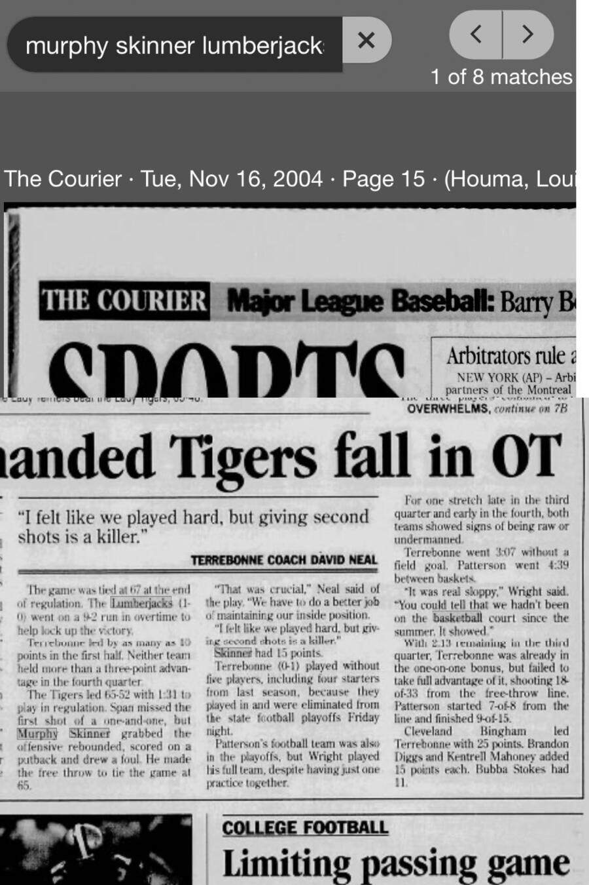

# Patterson 77, Terrebonne 74 (OT) — November 2004

## Recovered source

- Publication: *The Courier* (Houma, Louisiana)
- Publication date: Tuesday, November 16, 2004
- Page: 15
- Result: Patterson 77, Terrebonne 74 in overtime
- Murphy Skinner: 15 points according to *The Courier*
- Archive platform: Newspapers.com

The article reports that Skinner grabbed an offensive rebound, scored the putback, drew a foul and made the free throw to tie the game at 65 late in regulation. It later states that Skinner finished with 15 points.

This conflicts with *The Daily Review*, November 16, 2004, page 9, which reports 16 points. Until another detailed scoring line resolves the discrepancy, the archive records a 15–16 point range for this game rather than choosing one report without support.
