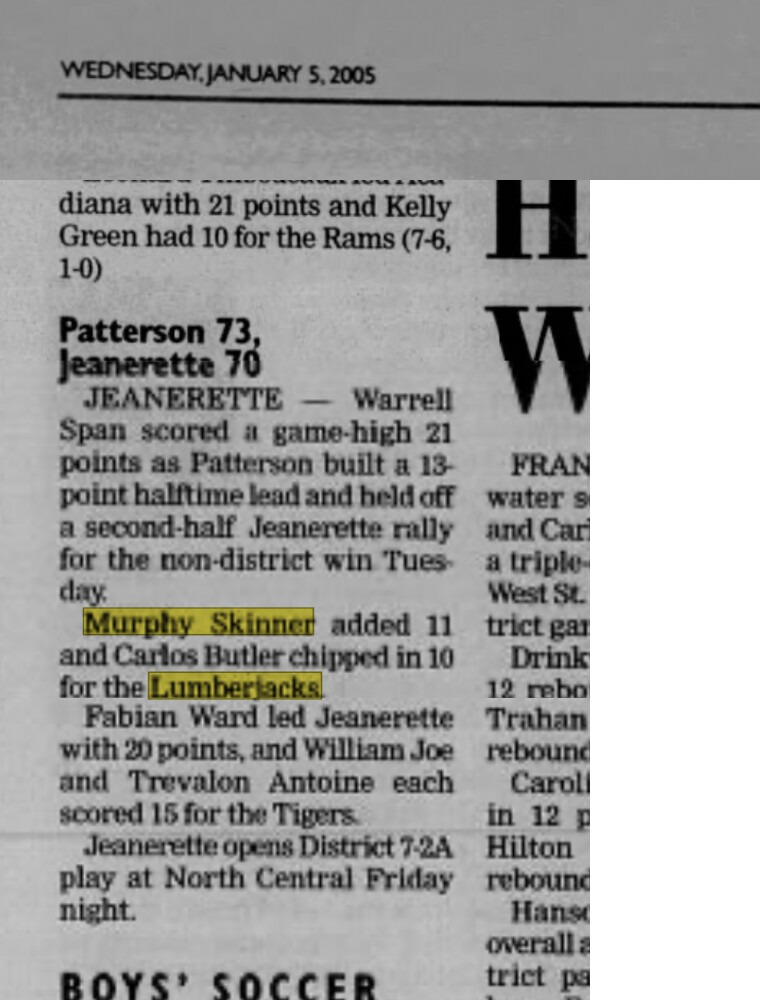

# Patterson 73, Jeanerette 70 — January 2005

Archived boys' basketball roundup dated Wednesday, January 5, 2005.

- Approximate game date: January 4, 2005
- Result: Patterson 73, Jeanerette 70
- Murphy Skinner: 11 points
- Warrell Span: 21 points
- Carlos Butler: 10 points
- Context: Patterson built a 13-point halftime lead and held off Jeanerette's second-half rally.
- Citation note: the publication name and page number are not visible in the recovered screenshots.

