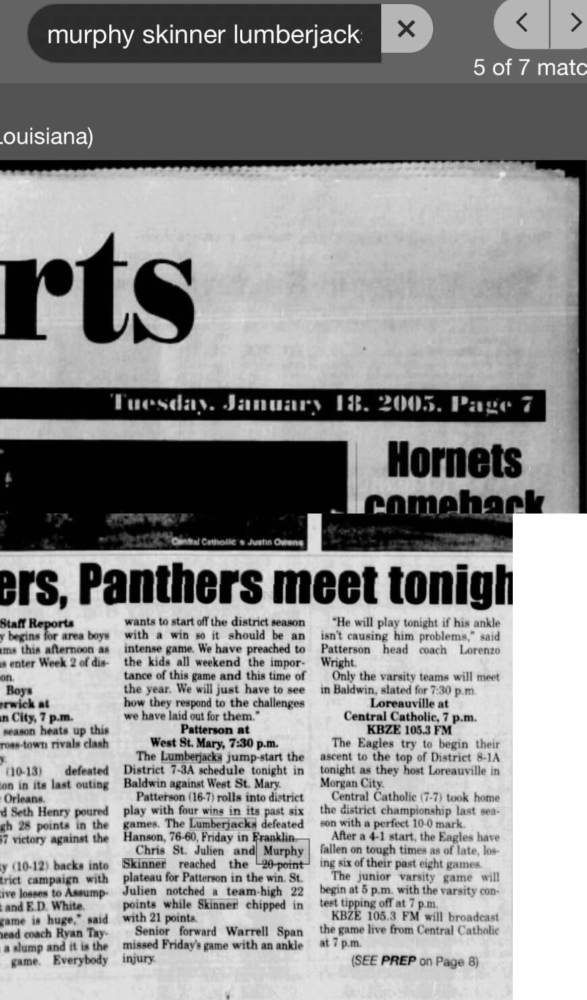

# Patterson 76, Hanson 60 — January 2005

## Recovered source

- Publication date: Tuesday, January 18, 2005
- Publication name: not visible in the recovered screenshots
- Page: 7
- Result: Patterson 76, Hanson 60
- Murphy Skinner: 21 points
- Archive platform: Newspapers.com

The district preview states that Patterson defeated Hanson 76–60 the previous Friday in Franklin. It reports that Chris St. Julien scored a team-high 22 points while Skinner added 21, giving Patterson two 20-point scorers in the victory.

This is a second located source for the game. *The Daily Review*, January 17, 2005, page 9, already documented the result and Skinner's 21 points. The new screenshots were added as supporting evidence and do not represent another game or additional points in the main subtotal.
