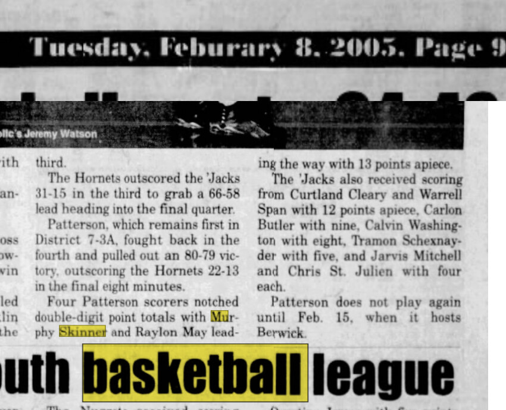

# Patterson 80, Franklin 79 — February 2005

*The Daily Review*, Tuesday, February 8, 2005, page 9.

- Result: Patterson 80, Franklin 79
- Murphy Skinner: 13 points
- Raylon May: 13 points
- Curtland Cleary: 12 points
- Warrell Span: 12 points
- Context: Patterson entered the fourth quarter trailing 66–58, then outscored Franklin 22–13 to win by one point.
- Date note: the recovered clipping contains an internal date conflict, so the exact game date remains unverified.

