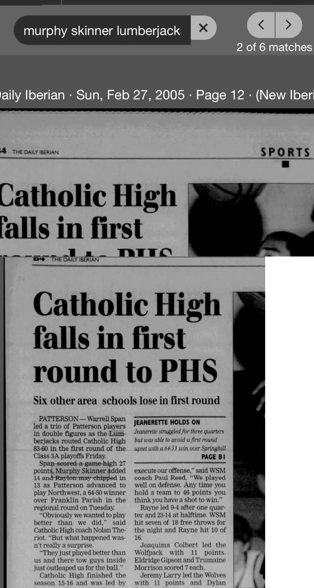

# Patterson 83, Catholic High–New Iberia 60 — 2005 Class 3A first round

## Recovered source

- Publication: *The Daily Iberian* (New Iberia, Louisiana)
- Publication date: Sunday, February 27, 2005
- Page: 12
- Game date: Friday, February 25, 2005
- Result: Patterson 83, Catholic High–New Iberia 60
- Murphy Skinner: 14 points
- Archive platform: Newspapers.com

The article reports that Warrell Span led Patterson with a game-high 27 points, Skinner added 14 and Raylon May scored 13. Patterson advanced to face Northwest in the regional round.

The archive already documented Patterson's 83–60 first-round victory, but it did not previously include Skinner's scoring total. This source adds 14 points and one game to the recovered senior-season scoring subtotal.
