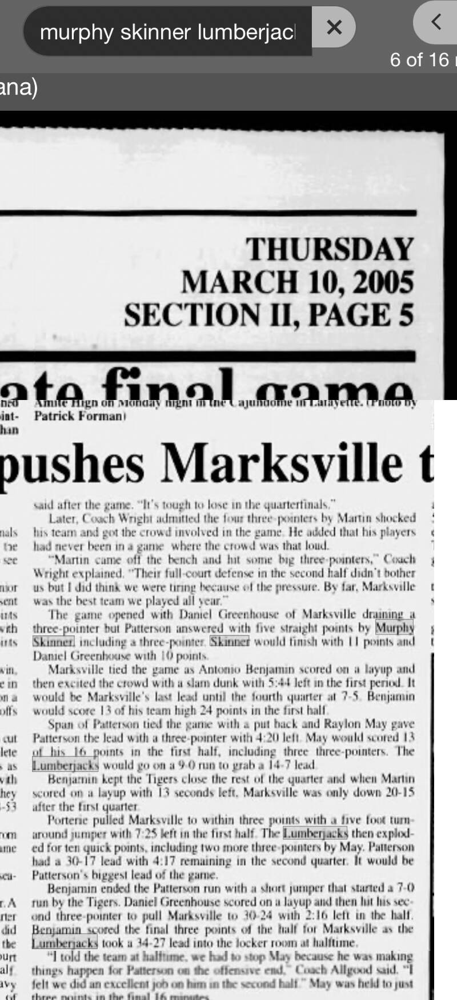

# Marksville 73, Patterson 63 — 2005 Class 3A quarterfinal

## Recovered source

- Publication date: Thursday, March 10, 2005
- Publication name: not visible in the recovered screenshots
- Page: Section II, page 5
- Known result: Marksville 73, Patterson 63
- Murphy Skinner: 11 points
- Archive platform: Newspapers.com

The article states that Patterson answered Marksville's opening three-pointer with five straight points by Skinner, including a three-pointer. It then reports that Skinner finished with 11 points.

The archive already documented Patterson's 73–63 quarterfinal loss to Marksville as the final game of Skinner's high school career. This source newly supplies Skinner's individual scoring total, so the game is now included in the recovered senior-season scoring subtotal.
